# "그럴듯한 답변" 대신 "근거 있는 답변"을 만들기까지
## HireLog RAG를 다시 설계한 이유와 과정

RAG를 처음 붙일 때는 다 비슷하게 시작합니다.
질문을 받고, 비슷한 문서를 찾고, LLM으로 답변을 생성합니다.

저도 그렇게 시작했습니다. 그리고 금방 한계를 만났습니다.

- "서류합격 공고의 특징" 같은 질문을 검색 문제처럼 처리하게 됐고,
- 결과는 분석이 아니라 기술스택 나열로 쏠렸고,
- 왜 이 답이 나왔는지 나중에 설명하기도 어려웠습니다.

이 글은 그 실패를 어떻게 분류했고, 왜 지금 구조를 선택했는지에 대한 기록입니다.

---

## 1. 첫 시도에서 무엇이 틀렸나

초기 버전은 파이프라인이 단순했습니다.

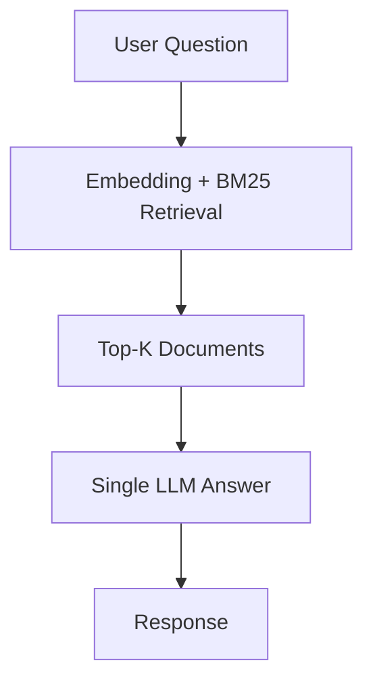

이 구조는 문서 검색에는 동작했지만, 분석 질문에서는 구조적으로 실패했습니다.

문제는 질문의 타입이 서로 다르다는 점이었습니다.

- "비슷한 공고 찾아줘"는 검색 문제
- "합격 공고 공통점은?"은 집계/비교 문제
- "내 면접 패턴 분석"은 개인 경험 데이터 문제

모두를 한 경로로 처리하면 당연히 품질이 흔들립니다.

특히 이때 가장 크게 느낀 건, 모델 품질 문제가 아니라 **문제 정의 오류**였습니다.
검색형 질문과 분석형 질문을 구분하지 않으면, 어떤 모델을 써도 결과는 불안정했습니다.
이 지점에서 \"프롬프트를 더 잘 쓰면 해결될까\"를 여러 번 시도했지만,
결론은 \"프롬프트 개선만으로는 구조적 문제를 해결할 수 없다\"였습니다.

---

## 2. 그래서 어떤 선택을 했나: 질문을 먼저 해석한다

핵심 결정은 하나였습니다.

> 먼저 질문을 해석하고, 그다음 실행 경로를 나눈다.

즉 Parser-first로 바꿨습니다.

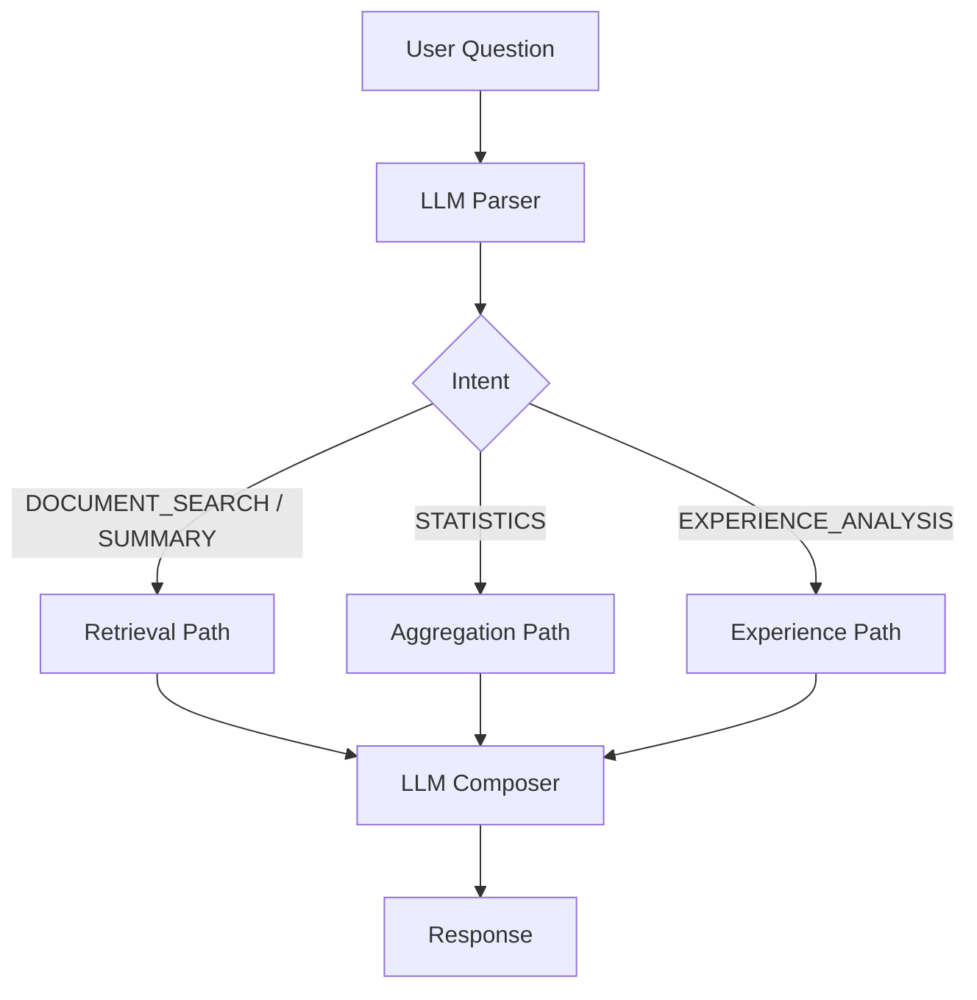

이 선택의 이유는 단순합니다.
"잘 답변하는 모델"보다 "어디서 틀렸는지 추적 가능한 시스템"이 운영에서 더 중요했기 때문입니다.

여기서 고려했던 대안은 두 가지였습니다.

- 대안 A: Intent 분기 없이 Retrieval 강화 (rerank, 더 큰 top-k)
- 대안 B: Intent 분기 후 실행 경로 분리

실제 운영 관점에서는 B가 맞았습니다.
이유는 정확도 때문만이 아니라, 장애 대응/디버깅/비용제어가 전부 B에서만 가능했기 때문입니다.

---

## 3. 왜 LLM을 한 번이 아니라 여러 번 호출했나

초기에는 파싱/분석/생성을 한 번의 호출로 합치려 했습니다.
하지만 실패 원인을 분리할 수 없었습니다.

그래서 역할별 호출로 분해했습니다.

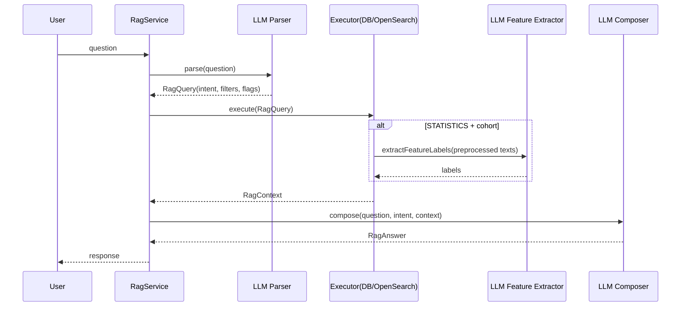

호출 수는 intent에 따라 다릅니다.

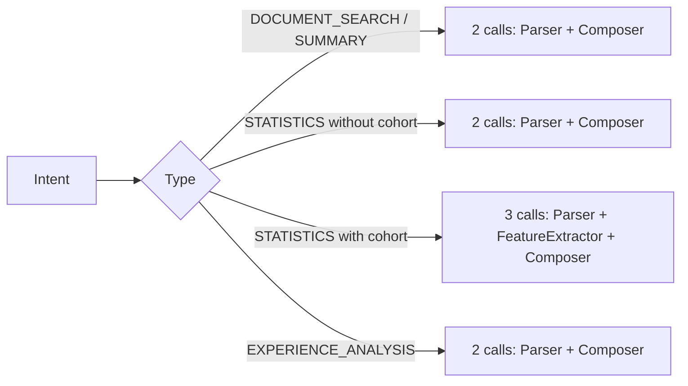

결정 이유:
- 파싱 품질 문제는 Parser에서,
- 근거 구성 문제는 Executor/Feature에서,
- 문장화 문제는 Composer에서
각각 고칠 수 있게 만들기 위해서입니다.

Parser가 실제로 뽑는 핵심 필드는 아래입니다.

- intent: `DOCUMENT_SEARCH | SUMMARY | STATISTICS | EXPERIENCE_ANALYSIS`
- semanticRetrieval: 임베딩 검색 필요 여부
- aggregation / baseline: 집계 및 전체 대비 비교 필요 여부
- focusTechStack: 기술 빈도 중심 질문 여부
- filters: `saveType`, `stage`, `stageResult`, `careerType`, `companyDomain`, `techStacks`, `brandName`, `dateRange`
- parsedText: retrieval/aggregation에 넘길 정규화 질문 텍스트

예시 1) 검색형 질문

질문:
`"Kafka 쓰는 백엔드 공고 찾아줘"`

Parser 출력 예시:

```json
{
  "intent": "DOCUMENT_SEARCH",
  "semanticRetrieval": true,
  "aggregation": false,
  "baseline": false,
  "focusTechStack": true,
  "parsedText": "Kafka 백엔드 공고",
  "filters": {
    "saveType": null,
    "stage": null,
    "stageResult": null,
    "careerType": null,
    "companyDomain": null,
    "techStacks": ["Kafka"],
    "brandName": null,
    "dateRangeFrom": null,
    "dateRangeTo": null
  }
}
```

예시 2) 통계형 질문

질문:
`"서류합격한 공고의 공통점 알려줘"`

Parser 출력 예시:

```json
{
  "intent": "STATISTICS",
  "semanticRetrieval": false,
  "aggregation": true,
  "baseline": true,
  "focusTechStack": false,
  "parsedText": "서류합격한 공고의 공통점 알려줘",
  "filters": {
    "saveType": null,
    "stage": "DOCUMENT",
    "stageResult": "PASSED",
    "careerType": null,
    "companyDomain": null,
    "techStacks": null,
    "brandName": null,
    "dateRangeFrom": null,
    "dateRangeTo": null
  }
}
```

예시 3) 경험 분석 질문

질문:
`"내가 코딩테스트에서 자주 막힌 유형 분석해줘"`

Parser 출력 예시:

```json
{
  "intent": "EXPERIENCE_ANALYSIS",
  "semanticRetrieval": false,
  "aggregation": false,
  "baseline": false,
  "focusTechStack": false,
  "parsedText": "내가 코딩테스트에서 자주 막힌 유형 분석해줘",
  "filters": {
    "saveType": null,
    "stage": "CODING_TEST",
    "stageResult": null,
    "careerType": null,
    "companyDomain": null,
    "techStacks": null,
    "brandName": null,
    "dateRangeFrom": null,
    "dateRangeTo": null
  }
}
```

추가로 중요한 이유가 하나 더 있었습니다.
호출을 분리하면 실패를 \"부분 실패\"로 처리할 수 있습니다.
예를 들어 Parser가 fallback 되어도 검색 답변은 반환할 수 있고,
Feature 단계가 비어도 aggregation 기반 답변은 유지할 수 있습니다.
한 번 호출 구조에서는 이런 완충이 거의 불가능했습니다.

---

## 4. 실행 경로는 어떻게 분리됐나

### 4-1) 검색 질문은 검색 경로로

실패 경험:
- BM25만 사용했을 때, 키워드가 정확히 겹치지 않는 연관 공고를 놓치는 케이스가 반복됐습니다.
- 예: 표현은 다르지만 같은 역할/문맥의 공고가 검색 상위에 오르지 않음.

해결 결정:
- DB 저장 후 인덱싱 시 텍스트를 벡터화하고, OpenSearch에 `embedding_vector`를 함께 저장
- 질의 시 `BM25 + kNN` 하이브리드로 결합해 키워드 정합성과 의미 유사도를 동시에 확보

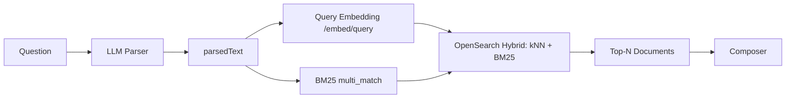

결정 이유:
검색 질문에서는 의미 유사도와 키워드 정합성이 모두 필요했기 때문입니다.

실무에서 보면, 임베딩만 쓰면 키워드 정확도가 떨어지고,
BM25만 쓰면 의미 유사 질의를 놓칩니다.
그래서 두 축을 함께 가져가되, 검색 질문에서만 이 비용을 쓰도록 제한했습니다.

여기서 구분 기준은 명확합니다.

- 필터로 구별할 것(정확 조건): `careerType`, `companyDomain`, `saveType`, `stage`, `dateRange`
- 연관도로 구별할 것(유사 문맥): 역할/업무/요건의 의미적 유사성

즉, \"정확 조건\"은 필터에서 자르고, \"비슷한 내용\"은 kNN으로 찾아야 합니다.

### 4-2) 통계 질문은 집계 경로로

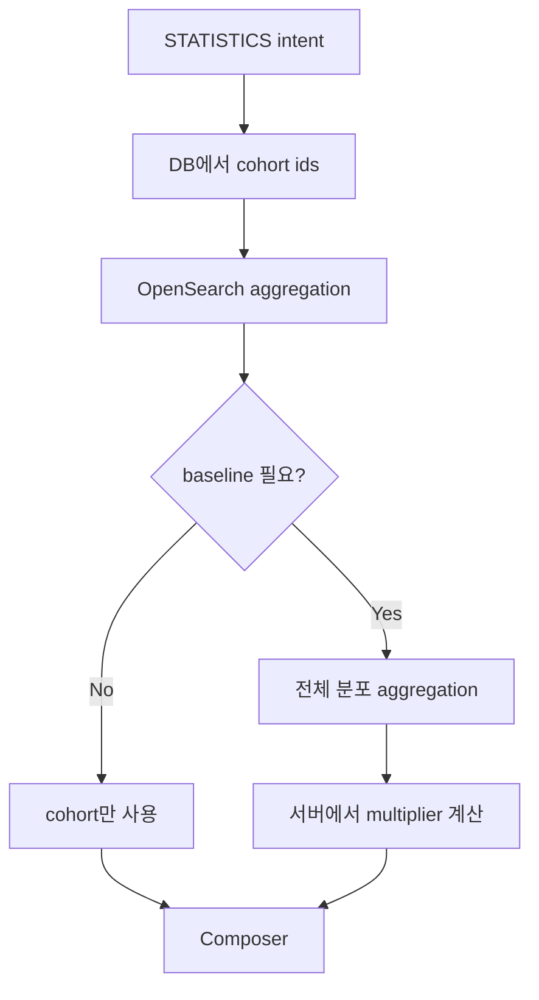

```text
multiplier = (cohortCount / cohortTotal) / (baselineCount / baselineTotal)
```

이 수식을 쓴 이유는 단순 count 비교가 cohort 크기에 따라 쉽게 왜곡되기 때문입니다.
cohort가 작으면 raw count만으로도 특정 항목이 과대해 보일 수 있고, 반대로 cohort가 크면 신호가 묻힐 수 있습니다.
초기에는 count 중심으로 해석해 표본 크기 차이에서 오는 오판이 있었고, 그래서 baseline 대비 비율(배율)로 바꿨습니다.

결정 이유:
숫자 계산을 LLM에 맡기면 재현성이 떨어지기 때문에, 계산은 반드시 서버에서 끝냅니다.

이 결정으로 얻은 가장 큰 장점은 \"답변 재실행 시 동일 수치 재현\"입니다.
동일 조건에서 동일 결과가 나오기 때문에, 사용자 문의 대응과 품질 점검이 쉬워졌습니다.

### 4-3) 경험 분석은 개인 데이터 경로로

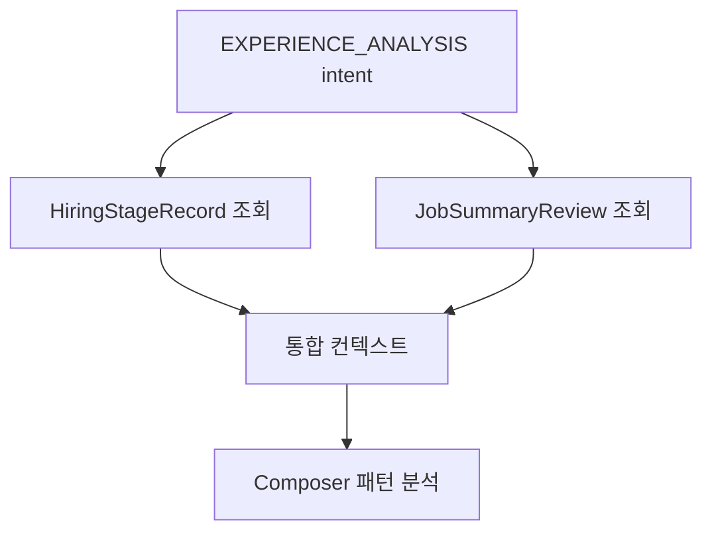

결정 이유:
이 질문은 검색보다 사용자의 이력 데이터가 본질이기 때문입니다.

경험 분석을 별도 intent로 분리한 뒤에는,
단순 공고 설명보다 실제 지원자 관점의 인사이트(반복되는 약점/강점)가 더 안정적으로 나왔습니다.

---

## 5. 실제 실패와 수정: 무엇을 바꿨고 왜 바꿨나

여기서부터는 실제로 품질을 흔든 실패들입니다.

### 실패 A. 특징 질문이 skill 나열로 쏠림

문제:
- "특징"을 물었는데 기술명 목록이 답변 중심이 됨

원인:
- techStack 신호가 과도하게 강했고
- 질문 의도를 구분하는 플래그가 없었음

해결:
- `focusTechStack` 도입
- 기술 빈도 질문일 때만 techStack 집계 포함
- 특징 질문은 textFeatures 우선 서술

구현 포인트:
- Parser 출력에 `focusTechStack` 필드를 고정해 의도 신호를 명시화
- Executor에서 `focusTechStack=false`일 때 techStack aggregation을 제외
- Composer 규칙에서 특징 질문은 textFeatures 먼저, techStack은 조건부 인용만 허용

결과:
- 특징/공통점 질문에서 기술명 나열 편향이 눈에 띄게 감소
- 답변이 \"스택 목록\"에서 \"채용 특성 설명\"으로 이동

분류 기준을 명시한 것도 중요했습니다.
\"특징/공통점/패턴\" 계열 질문에서는 기술 버킷을 기본 숨기고,
\"Spring/Kafka 얼마나\"처럼 기술 빈도를 직접 묻는 경우에만 techStack을 노출하도록 고정했습니다.

### 실패 B. 문서를 너무 잘라서 답변이 얕아짐

문제:
- 맞는 답인데 밀도가 낮고 반복적

원인:
- 안전하게 만들려고 절단을 과하게 적용
- precision을 올리다 recall을 크게 잃음

해결:
- 고정 절단 -> intent 기반 절단으로 전환
- 통계형/요약형에 따라 문맥 보존 전략 분리
- 핵심 문장(역할/문제/환경) 보존 규칙 추가

구현 포인트:
- 전처리 시 필드별 상한은 유지하되 intent에 따라 보존 우선순위를 변경
- 통계형은 증거 추출 가능성이 높은 문장을 우선 보존
- 요약형은 문맥 연결성을 우선 보존해 설명 밀도를 유지

결과:
- 답변 길이보다 정보 밀도가 좋아지고, 반복 문장 비율이 감소
- 같은 질문군에서 근거 문장 포함률이 개선

여기서 얻은 교훈은 \"짧게 자르면 안전\"이 아니라 \"짧게 자르면 빈약\"이 될 수 있다는 점이었습니다.
토큰 절약은 필요하지만, 답변 품질을 유지하려면 정보 밀도를 보존하는 절단 규칙이 함께 필요했습니다.

---

## 6. 실패를 운영에서 어떻게 다루고 있나

현재는 수동 루프입니다.

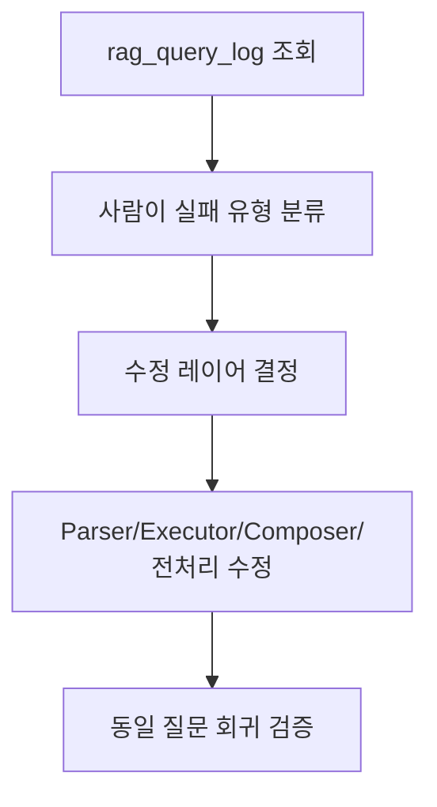

그리고 목표는 자동 루프 전환입니다.

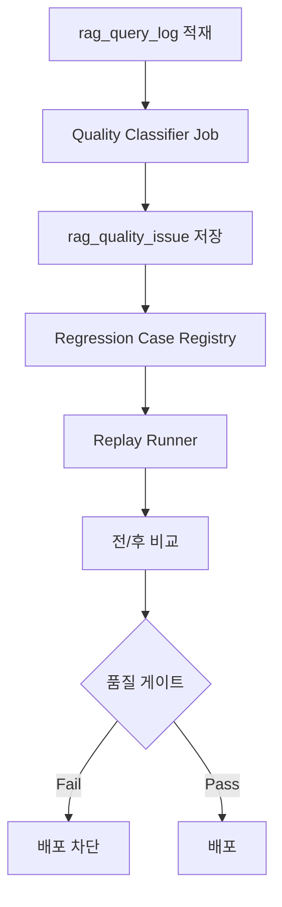

결정 이유:
실패 분석이 사람 의존이면 개선 속도가 트래픽 증가를 못 따라가기 때문입니다.

실제로 수동 루프의 병목은 명확했습니다.

- 사람이 로그를 읽는 시간
- 실패 유형 분류 기준의 일관성 부족
- 동일 질문 회귀 테스트의 반복 비용

그래서 자동화의 목적은 \"더 똑똑한 분석\"이 아니라 \"반복 작업의 기계화\"입니다.

실제 병목 사례:
- \"특징 질문에서 skill 편향\" 이슈 재발 시, 로그 선별 -> 유형 분류 -> 회귀 테스트를 수동으로 반복하면서
  반영까지 하루 이상 지연된 적이 있었습니다. 이 경험이 자동 분류/리플레이 전환의 직접적인 근거였습니다.

결과(현재 상태):
- 실패 대응의 재현성은 확보됐지만, 처리 속도는 아직 사람 처리량에 제한
- 그래서 다음 단계는 자동 분류/리플레이로 전환하는 것이 맞음

---

## 7. 운영에서 붙인 안전장치

### 7-1) 비용/남용 제어: 2중 Rate Limit

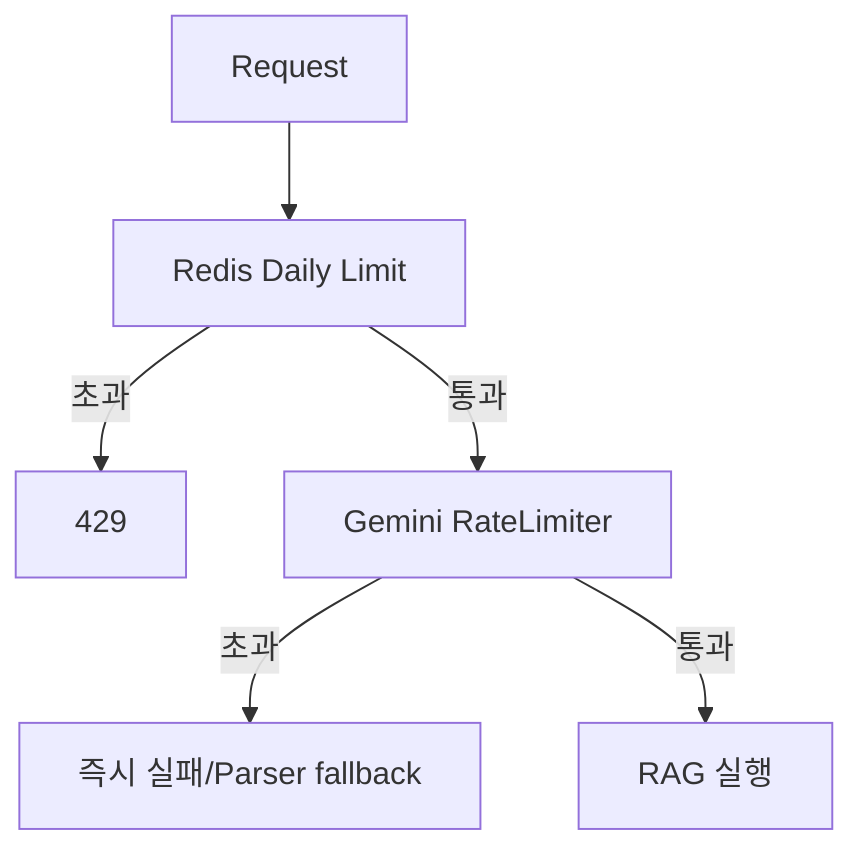

- USER 일 3회 제한
- ADMIN 무제한
- Gemini rate limiter는 파서 게이트 중심 적용

파서를 게이트로 둔 이유는 체인 중간 실패를 줄이기 위해서입니다.
진입 전에 실패시키는 것이, 중간에서 끊기는 것보다 UX/비용 측면에서 더 예측 가능합니다.

### 7-2) 재현성 확보: 파이프라인 전 과정 로깅

`rag_query_log`에 질문/파싱/컨텍스트/최종응답을 저장합니다.
이 로그가 있어야 품질 개선이 감에 의존하지 않습니다.

또한 이 로그는 글에 적은 실패 분류의 근거 데이터 역할을 합니다.
즉, \"느낌상 이상하다\"가 아니라, 동일 질문군에서 어떤 유형이 얼마나 발생했는지로 판단할 수 있게 됩니다.

결과:
- 이슈 재현 시간이 줄고, \"왜 이 답이 나왔는지\" 설명 가능한 케이스가 늘어남

---

## 8. 설계 트레이드오프: 품질을 얻는 대신 비용이 커졌다

100회 요청 테스트를 진행했고, 총비용은 약 **714~857원(평균 체감 약 800원)** 이 나왔습니다.
이를 1회 단가로 환산하면 약 **7.14~8.57원/회(평균 약 8원/회)** 입니다.

이 비용은 우연이 아니라 앞선 설계 결정의 결과입니다.
Parser-first 분기, 통계 경로의 추가 LLM 단계, 근거 중심 컨텍스트 전달이 품질을 올린 대신 단가를 키웠습니다.
즉 트래픽이 늘면 비용이 빠르게 커집니다.

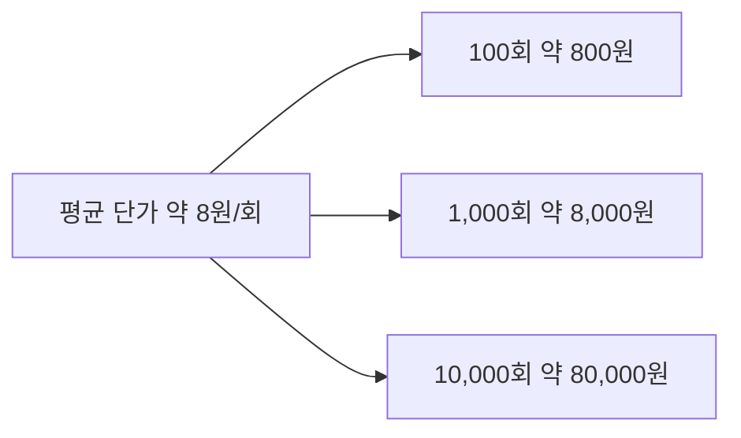

왜 비쌌는지 원인:
- 요청당 LLM 호출이 2~3회
- 통계/코호트 질문에서 컨텍스트 토큰 증가
- 캐시 부재로 유사질문도 매번 비용 발생

계산식:

```text
평균 단가 = 총비용 / 총요청수
예상 비용 = 평균 단가 × 요청수
```

정리하면, 이 비용은 \"잘못된 구현의 비용\"이 아니라
\"설명 가능성과 재현성을 얻기 위해 지불한 비용\"입니다.
그래서 본문 설계의 다음 과제는 기능 추가가 아니라 단가 최적화입니다.

---

## 9. 다음 과제: 특징 질문의 신호 우선순위 재조정

이 섹션은 아직 적용 완료된 변경이 아니라, 현재 확인된 한계에 대한 **미적용 과제**입니다.

문제:
- 여러 차례 테스트에서 사용자는 \"우대사항\"과 \"주요 업무\" 기반 특징을 기대하는데,
  현재 답변은 상대적으로 `careerType`, `positionCategory` 축에 과집중되는 경향이 있었습니다.

원인 추정:
- aggregation 우선순위와 composer 서술 순서가 정성 JD 필드(우대사항/주요업무)보다
  구조화 카테고리(경력/포지션 유형)를 먼저 소비하도록 설계되어 있기 때문입니다.

개선 방향:
1. 통계/특징 질문에서 `preferredQualifications`, `responsibilities` 기반 feature를 1순위 신호로 승격
2. `careerType`/`positionCategory`는 보조 근거로만 노출하도록 composer 정책 조정
3. \"특징\" intent에서는 우대사항/주요업무 관련 evidence 비율을 최소 기준 이상으로 강제

---

## 마무리

이 글에서 실제로 확인한 결론은 다음 4가지입니다.

1. Parser를 분리하니 \"어디서 실패했는지\"를 단계별로 추적할 수 있게 됐습니다.
2. 계산을 서버로 고정하니 통계 질문의 수치 재현성이 확보됐습니다.
3. `rag_query_log`를 남기니 체감이 아니라 근거 기반으로 개선 결정을 할 수 있게 됐습니다.
4. 품질을 올린 설계는 비용을 키웠고, 다음 최적화의 중심은 기능 추가가 아니라 단가 절감입니다.

즉, 이 RAG의 성과는 \"답변이 나온다\"가 아니라
\"실패를 분해하고, 재현하고, 다시 고칠 수 있는 구조\"를 만든 데 있습니다.

---

## Appendix: 컴포넌트 역할 경계

파일명 자체보다 \"각 컴포넌트가 무엇을 책임지는가\"가 이 구조의 핵심입니다.

| 컴포넌트 | 책임 | 하지 않는 일 |
|---|---|---|
| Parser | 질문을 intent/filters로 구조화 | 최종 답변 생성, 수치 계산 |
| Executor | DB/OpenSearch 실행, 수치/근거 계산 | 자연어 문장 생성 |
| Feature Extractor | 정성 라벨 추출 | 건수 계산, 근거 ID 생성 |
| Composer | 구조화 컨텍스트를 자연어로 설명 | 새 데이터 계산/추측 |
| Query Log | 질문~응답 전 과정 기록 | 품질 판정 자동화(현재 수동) |
